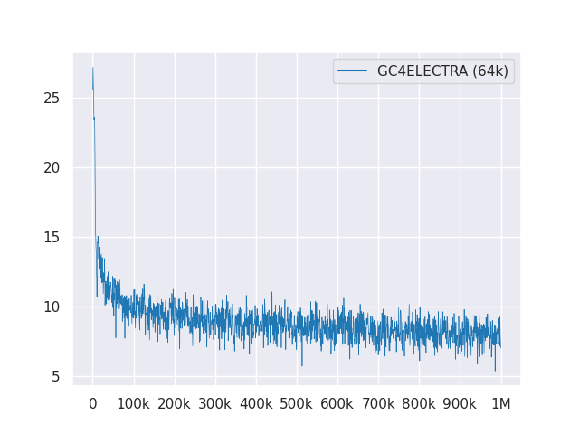

# GC4LM: A Colossal (Biased) language model for German

This repository presents a colossal (and biased) language model for German trained on the recently released
["German colossal, clean Common Crawl corpus"](https://german-nlp-group.github.io/projects/gc4-corpus.html) (GC4),
with a total dataset size of ~844GB.

---

**Disclaimer**: the presented and trained language models in this repository are for **research only** purposes.
The GC4 corpus - that was used for training - contains crawled texts from the internet. Thus, the language models can
be considered as highly biased, resulting in a model that encodes stereotypical associations along gender, race,
ethnicity and disability status. Before using and working with the released checkpoints, it is highly recommended
to read:

[On the Dangers of Stochastic Parrots: Can Language Models Be Too Big?](https://faculty.washington.edu/ebender/papers/Stochastic_Parrots.pdf)

from Emily M. Bender, Timnit Gebru, Angelina McMillan-Major and Shmargaret Shmitchell.

The aim of the released checkpoints is to boost research on large pre-trained language models for German, especially
for identifying biases and how to prevent them, as most research is currently done for English only.

---

Please use the new GitHub Discussions feature in order to discuss or present further research questions.
Feel free to use `#gc4lm` on Twitter 🐦.

# Changelog

* 02.05.2021: Initial version

# Preprocessing

After downloading the complete `HEAD` and `MIDDLE` parts of the GC4, we extract the downloaded archives and extract the
raw content (incl. language score filtering) with the provided
[Gist](https://gist.github.com/Phil1108/e1821fec6eb746edc8e04ef5f76d23f1) from the GC4 team.

In another pre-processing script we perform sentence-splitting of the whole pre-training corpus. One of the fastest solutions is to
use NLTK (with the German model) instead of using e.g. Spacy.

After extraction, language score filtering and sentence splitting, the resulting dataset size is **844GB**.

After sentence-splitting the next step is to create an ELECTRA-compatible vocab, that is described in the next section.

# Vocab generation

The vocab generation workflow is mainly inspired by a blog post from Judit Ács about ["Exploring BERT's Vocabulary"](https://juditacs.github.io/2019/02/19/bert-tokenization-stats.html)
and a recently released paper ["How Good is Your Tokenizer?"](https://arxiv.org/abs/2012.15613)
from Phillip Rust, Jonas Pfeiffer, Ivan Vulić, Sebastian Ruder and Iryna Gurevych.

We mainly focus on calculating the subword fertility on the training and development data for popular downstream
tasks such as named entity recognition (NER), PoS tagging and text classification. For that purpose we use the
tokenized training and development data from:

* [GermEval 2014](https://sites.google.com/site/germeval2014ner/data)
* [GermEval 2018](https://projects.fzai.h-da.de/iggsa/germeval-2018/) (Spacy is used for tokenization)
* [Universal Dependencies - German HDT](https://github.com/UniversalDependencies/UD_German-HDT)

and calculate the subword fertility and portion of unknown (sub)words for various released German language models:

| Model name                     | Subword fertility | `UNK` portion
| ------------------------------ | ----------------- | -------------
| `bert-base-german-cased`       | 1.4433            | 0.0083%
| `bert-base-german-dbmdz-cased` | 1.4070            | 0.0050%
| This work (32k)                | 1.3955            | 0.0011%
| This work (64k)                | 1.3050            | 0.0011%

We then decided to create a new vocabulary based on the `HEAD` and `MIDDLE` parts from GC4. We select the following archives to generate a new vocab on:

* `0000_2015-48` (from `HEAD`, 2.5GB)
* `0004_2016-44` (from `HEAD`, 2.1GB) and `0006_2016-44` (from `MIDDLE`, 861MB)
* `0003_2017-30` (from `HEAD`, 2.4GB) and `0007_2017-51` (from `MIDDLE`, 1.1GB)
* `0007_2018-30` (from `HEAD`, 409MB) and `0007_2018-51` (from `MIDDLE`, 4.9GB)
* `0006_2019-09` (from `HEAD`, 1.8GB) and `0008_2019-30` (from `MIDDLE`, 2.2GB)
* `0003_2020-10` (from `HEAD`, 4.5GB) and `0007_2020-10` (from `MIDDLE`, 4.0GB)

This results in a corpus with a size of 27GB that is used for vocab generation.

We decided to generate both a 32k and 64k sized vocabularies, using the awesome Hugging Face [Tokenizers](https://github.com/huggingface/tokenizers) library.

# GC4ELECTRA

The first large pre-trained language model on the GC4 corpus is an ELECTRA-based model: *GC4ELECTRA*. It was trained
with the same parameters as the Turkish ELECTRA model on a v3-32 TPU. It uses the **64k** vocabulary (32k model is currently training).

**Notice**: we do not release **one** model. Instead, we release all model checkpoints (with a 100k step-width), for more research possibilities.

The following checkpoints are available from the Hugging Face Model Hub. Thanks Hugging Face for providing this amazing infrastructure!!

We also include the original TensorFlow checkpoint in each model on the hub.

## Discriminator & generator checkpoints

| Model Hub Name                                                                                                                                                                                                                                                            | Checkpoint (Step)
| ------------------------------------------------------------------------------------------------------------------------------------------------------------------------------------------------------------------------------------------------------------------------- | -----------------
| [`electra-base-gc4-64k-0-cased-discriminator`](https://huggingface.co/stefan-it/electra-base-gc4-64k-0-cased-discriminator)             - [`electra-base-gc4-64k-0-cased-generator`](https://huggingface.co/stefan-it/electra-base-gc4-64k-0-cased-generator)             | 0 (Initial)
| [`electra-base-gc4-64k-100000-cased-discriminator`](https://huggingface.co/stefan-it/electra-base-gc4-64k-100000-cased-discriminator)   - [`electra-base-gc4-64k-100000-cased-generator`](https://huggingface.co/stefan-it/electra-base-gc4-64k-100000-cased-generator)   | 100,000 steps
| [`electra-base-gc4-64k-200000-cased-discriminator`](https://huggingface.co/stefan-it/electra-base-gc4-64k-200000-cased-discriminator)   - [`electra-base-gc4-64k-200000-cased-generator`](https://huggingface.co/stefan-it/electra-base-gc4-64k-200000-cased-generator)   | 200,000 steps
| [`electra-base-gc4-64k-300000-cased-discriminator`](https://huggingface.co/stefan-it/electra-base-gc4-64k-300000-cased-discriminator)   - [`electra-base-gc4-64k-300000-cased-generator`](https://huggingface.co/stefan-it/electra-base-gc4-64k-300000-cased-generator)   | 300,000 steps
| [`electra-base-gc4-64k-400000-cased-discriminator`](https://huggingface.co/stefan-it/electra-base-gc4-64k-400000-cased-discriminator)   - [`electra-base-gc4-64k-400000-cased-generator`](https://huggingface.co/stefan-it/electra-base-gc4-64k-400000-cased-generator)   | 400,000 steps
| [`electra-base-gc4-64k-500000-cased-discriminator`](https://huggingface.co/stefan-it/electra-base-gc4-64k-500000-cased-discriminator)   - [`electra-base-gc4-64k-500000-cased-generator`](https://huggingface.co/stefan-it/electra-base-gc4-64k-500000-cased-generator)   | 500,000 steps
| [`electra-base-gc4-64k-600000-cased-discriminator`](https://huggingface.co/stefan-it/electra-base-gc4-64k-600000-cased-discriminator)   - [`electra-base-gc4-64k-600000-cased-generator`](https://huggingface.co/stefan-it/electra-base-gc4-64k-600000-cased-generator)   | 600,000 steps
| [`electra-base-gc4-64k-700000-cased-discriminator`](https://huggingface.co/stefan-it/electra-base-gc4-64k-700000-cased-discriminator)   - [`electra-base-gc4-64k-700000-cased-generator`](https://huggingface.co/stefan-it/electra-base-gc4-64k-700000-cased-generator)   | 700,000 steps
| [`electra-base-gc4-64k-800000-cased-discriminator`](https://huggingface.co/stefan-it/electra-base-gc4-64k-800000-cased-discriminator)   - [`electra-base-gc4-64k-800000-cased-generator`](https://huggingface.co/stefan-it/electra-base-gc4-64k-800000-cased-generator)   | 800,000 steps
| [`electra-base-gc4-64k-900000-cased-discriminator`](https://huggingface.co/stefan-it/electra-base-gc4-64k-900000-cased-discriminator)   - [`electra-base-gc4-64k-900000-cased-generator`](https://huggingface.co/stefan-it/electra-base-gc4-64k-900000-cased-generator)   | 900,000 steps
| [`electra-base-gc4-64k-1000000-cased-discriminator`](https://huggingface.co/stefan-it/electra-base-gc4-64k-1000000-cased-discriminator) - [`electra-base-gc4-64k-1000000-cased-generator`](https://huggingface.co/stefan-it/electra-base-gc4-64k-1000000-cased-generator) | 1M steps

**Notice**: You should use the generator models for MLM tasks like masked token prediction. The discriminator models should be used for fine-tuning
on downstream tasks like NER, PoS tagging, text classication and many more.

## Training Loss

The following plot shows the loss curve over 1M steps:

# License

All models are licensed under [MIT](LICENSE).

# Contact (Bugs, Feedback, Contribution and more)

Please use the new [GitHub Discussions](https://github.com/stefan-it/gc4-lms/discussions) for feedback or just fill a PR for suggestions/corrections.

# Acknowledgments

Thanks to [Philip May](https://github.com/PhilipMay), [Philipp Reißel](https://github.com/Phil1108) and to [iisys](the Institute of Information Systems Hof University)
for releasing and hosting the "German colossal, cleaned Common Crawl corpus" (GC4).

Research supported with Cloud TPUs from Google's TensorFlow Research Cloud (TFRC).
Thanks for providing access to the TFRC ❤️

Thanks to the generous support from the [Hugging Face](https://huggingface.co/) team,
it is possible to store and download all checkpoints from their Model Hub 🤗
